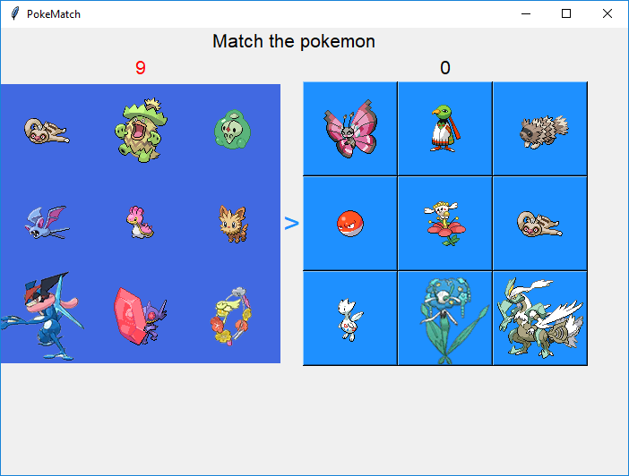

Poke-Match
==========

Poke-Match is a simple but infuriating game. Match the Pokemon on the right with one on the left.

|pokematch|

Install
-------

Poke-Match uses guizero_ which can be installed using ``pip``.

Raspberry Pi / Linux::

    sudo pip3 install guizero

MacOS / Windows::

    pip3 install guizero

Clone the pokematch repository::

    git clone https://github.com/martinohanlon/pokematch

Run
---

Raspberry Pi / MacOS / Linux ::

    cd pokematch
    python3 pokematch.py

Windows ::

    cd pokematch
    python3 pokematch.py

Sprites
-------

The sprites were obtained from  https://github.com/PokeAPI/sprites

.. _guizero: https://lawsie.github.io/guizero

